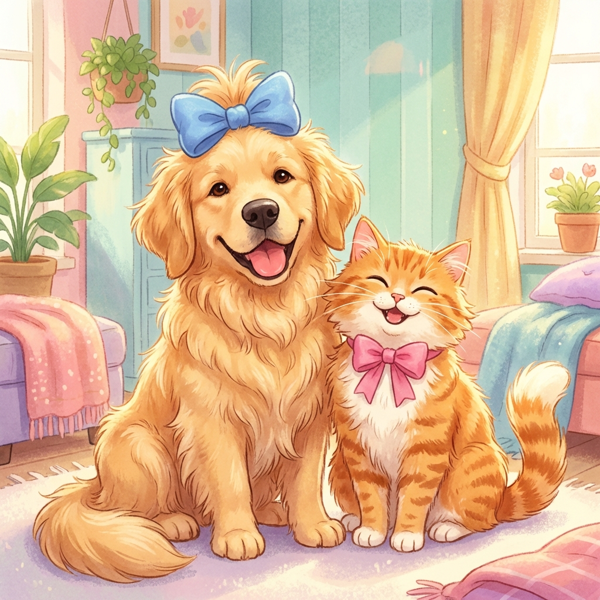

# Paws & Claws - Pet Grooming Landing Page

A stunning, playful, and friendly landing page template for pet grooming services. Built with HTML, Tailwind CSS, and a custom Claymorphism design style.

## Features

- 🎨 **Claymorphism Design**: Soft shadows, rounded corners, and vibrant colors.
- 📱 **Fully Responsive**: Looks great on mobile, tablet, and desktop.
- 🐾 **Pet-Friendly Theme**: Blue and Orange color palette with playful fonts (Fredoka + Nunito).
- 🛠 **No Build Tools**: Pure HTML/CSS setup. Works instantly.

## Usage

You can use this package as a template for your own pet service website.

### Quick Start

1. Download or clone this package.
2. Open `index.html` in your browser.

### Customization

- **Colors**: Edit the CSS variables in `style.css` (root section).
- **Text**: Update the HTML content in `index.html`.
- **Images**: Replace images in the `assets/` folder.

## File Structure

- `index.html`: Main landing page structure.
- `style.css`: Custom animations and design system.
- `assets/`: Images and static resources.

## License

MIT
